# Modelo de datos de RUPI

## Modelo integral y despliegue por etapas

El SQL define el modelo relacional objetivo de los dominios necesarios para las 60 historias y la arquitectura React/Kotlin → Spring Boot, React de administracion → Django y MySQL compartido. Las 77 tablas son el modelo completo, no un compromiso de construir todos los servicios en una sola entrega. Cada conjunto se implementara con su historia y migracion, manteniendo desde el inicio una propiedad de escritura clara.

## Dominios y relaciones

```mermaid
erDiagram
  identidad_cuenta_usuario ||--o| identidad_perfil_usuario : perfil
  identidad_cuenta_usuario ||--o{ identidad_usuario_rol : roles
  identidad_rol ||--o{ identidad_usuario_rol : asignado
  identidad_rol ||--o{ identidad_rol_permiso : concede
  identidad_permiso ||--o{ identidad_rol_permiso : permiso
  escuela_institucion ||--o{ escuela_anio_escolar : organiza
  escuela_anio_escolar ||--o{ escuela_aula : contiene
  escuela_aula ||--o{ escuela_membresia_aula : integra
  identidad_cuenta_usuario ||--o{ escuela_membresia_aula : participa
  curriculo_version_catalogo ||--o{ curriculo_area : versiona
  curriculo_area ||--o{ curriculo_competencia : contiene
  curriculo_unidad ||--o{ curriculo_unidad_competencia : desarrolla
  curriculo_competencia ||--o{ curriculo_unidad_competencia : vincula
  aprendizaje_actividad ||--o{ aprendizaje_version_actividad : versiona
  aprendizaje_version_actividad ||--o{ aprendizaje_bloque_contenido : compone
  aprendizaje_ruta ||--o{ aprendizaje_version_ruta : versiona
  aprendizaje_version_ruta ||--o{ aprendizaje_nodo_ruta : organiza
  aprendizaje_version_actividad ||--o{ aprendizaje_nodo_ruta : alimenta
  aprendizaje_inscripcion_ruta ||--o{ aprendizaje_progreso_nodo : registra
  aprendizaje_nodo_ruta ||--o{ aprendizaje_progreso_nodo : progresa
  aprendizaje_tarea ||--o{ aprendizaje_entrega_tarea : asigna
  identidad_cuenta_usuario ||--o{ aprendizaje_entrega_tarea : entrega
  identidad_cuenta_usuario ||--o{ aprendizaje_recomendacion_refuerzo : recibe
  aprendizaje_recomendacion_refuerzo }o--|| aprendizaje_version_actividad : sugiere
  evaluacion_intento ||--o{ evaluacion_respuesta : contiene
  evaluacion_pregunta ||--o{ evaluacion_respuesta : responde
  evaluacion_respuesta ||--o{ evaluacion_respuesta_opcion : selecciona
  evaluacion_opcion_respuesta ||--o{ evaluacion_respuesta_opcion : opcion
  identidad_cuenta_usuario ||--o{ gamificacion_movimiento_experiencia : acumula
  identidad_cuenta_usuario ||--o{ notificacion_mensaje : recibe
  identidad_cuenta_usuario ||--o{ notificacion_programacion : programa
  ia_conversacion_tutor ||--o{ ia_mensaje_tutor : contiene
  ia_mensaje_tutor ||--o{ ia_evento_moderacion : evalua
  operaciones_respaldo ||--o{ operaciones_prueba_recuperacion : valida
```

El diagrama ER completo, incluidas todas las FK, esta en [`rupi.dbml`](rupi.dbml). Este resumen muestra los enlaces principales para que el documento siga legible.

## Motivo de separacion de tablas

- **Identidad y permisos:** una cuenta puede tener mas de un rol; cada rol concede muchos permisos. Sesiones, instalaciones de dispositivo, tokens push y factores MFA son entidades independientes porque tienen expiracion, revocacion y credenciales propias.
- **Escuela:** institucion, anio escolar, aula, membresia, consentimiento y periodo tienen ciclos de vida distintos. Una membresia relaciona usuario con aula y conserva rol/estado sin duplicar nombres de aula o persona.
- **Curriculo:** catalogo y elementos versionados permiten conservar la referencia educativa usada por una ruta. Competencias, metas, estandares y unidades tienen relaciones muchos-a-muchos explicitas.
- **Contenido y rutas:** la actividad representa el recurso logico; las versiones permiten editar sin cambiar una ruta publicada. Bloques, nodos, opciones y tarjetas son filas ordenables, no arreglos JSON.
- **Asignacion y evaluacion:** la tarea define el trabajo; una entrega por alumno guarda vencimiento y estado. Los intentos, respuestas y selecciones de opciones estan separados para permitir varios intentos y consultas de resultados.
- **Refuerzo:** una recomendacion conserva estudiante, unidad, actividad sugerida, decision del docente y entrega resultante; puede aprobarse, ajustarse o rechazarse sin perder la sugerencia original.
- **Gamificacion:** los movimientos XP son un libro de eventos con clave de idempotencia. Insignias y accesorios se catalogan una vez y se vinculan con cada estudiante que los obtiene.
- **IA y notificaciones:** una politica versionada puede asociarse a aula; conversaciones y mensajes conservan contexto, moderacion y retencion. Preferencias, dispositivos, mensaje y cada entrega de canal tienen ciclos independientes.
- **Operaciones:** sincronizacion guarda metadatos de idempotencia; incidentes conservan resumen/inicio/cierre, mientras las metricas detalladas viven fuera; respaldo guarda referencias y resultado, no los archivos.

## Normalizacion e invariantes

Las relaciones base evitan duplicar datos descriptivos: la pertenencia a aula no copia institucion/grado en cada usuario; una respuesta no copia el enunciado de la pregunta; una ruta apunta a versiones de actividad; y cada entidad de catalogo mantiene su propia clave. Las tablas puente resuelven relaciones N:M. Los valores acumulados de XP, avance, racha, clasificacion y analitica se calculan desde eventos de origen y no se guardan como copias susceptibles de divergir.

Se incluyen claves compuestas donde una FK debe respetar el mismo contexto: una ruta y su nodo, una respuesta y su opcion dentro de la misma pregunta, o un aula y el anio escolar de su institucion. Los indices unicos soportan codigo de acceso, versionado e idempotencia. La sesion activa usa una columna generada unica para hacer cumplir la regla de una sesion vigente por cuenta; la aplicacion debe cerrar o revocar la anterior en una transaccion antes de crear otra.

Las FK no pueden validar todas las reglas de negocio. Django/Spring deben verificar, por ejemplo, que el rol coincida con el tipo de membresia, que un docente gestione esa aula, que preguntas/opciones pertenezcan a la version asignada, que solo se publique contenido valido, que el grado de una meta concuerde con su competencia, y que los codigos no superen su limite de usos. Estas validaciones requieren servicios transaccionales y, cuando proceda, restricciones/indices adicionales probados en MySQL.

## Elementos calculados o externos

- Los reportes docentes, porcentajes, rachas, lideres y puntajes comparativos se consultan desde progreso, sesiones, intentos y movimientos XP. Si el volumen futuro lo exige, se incorporaran proyecciones/caches reconstruibles, sin convertirlas en fuente primaria.
- Los archivos de actividades, audio, ilustraciones y respaldos permanecen en almacenamiento de objetos. MySQL almacena metadatos y referencias.
- Metricas de CPU, RAM, latencia, disponibilidad, trazas y alertas residen en monitoreo externo. Las tablas `operaciones_*` conservan solo eventos de negocio/operacion de bajo volumen.
- Los paquetes offline pueden generarse desde actividades y recursos. Solo se persistira un trabajo/cache si se demuestra que la generacion necesita ser asincrona.

## Consideraciones que deben resolverse al implementar

- Definir en la primera migracion el mecanismo final de UUID entre Django y Java: ambos backends deben usar exactamente la misma representacion y reglas de generacion.
- Establecer ejecucion unica y orden de migraciones compartidas; `schema.sql` sirve como modelo/referencia, no como autorizacion para que cada backend altere tablas ajenas.
- Acordar retencion y borrado de conversaciones, intentos, auditoria, eventos de sincronizacion y consentimientos, incluyendo borrado/anonimizacion de cuenta.
- Aplicar privacidad de menores, control de acceso por escuela/aula y cifrado de secretos desde los servicios. La FK por si sola no da aislamiento entre instituciones.
- Probar en MySQL 8.4 las restricciones `CHECK`, columnas generadas, claves compuestas e indices. Este entorno no tiene servidor MySQL, asi que el SQL no se declara ejecutado.
